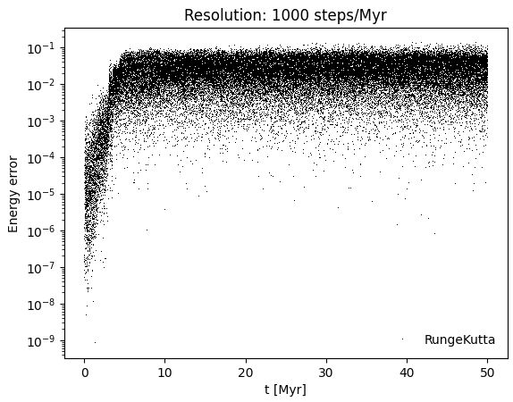

# N-BodySimulation_Euler_RungeKutta
Investigating the relative energy loss due to truncation errors in different numerical methods, with a focus on their dependence on time resolution.
For the initial conditions the Plummer Model has been used with a total mass of 100 and a half mass radius of 0.5.
Sample of 100 bodies

Resolution for 1000 steps per Myr.  

This is the resulting relative energy loss via the Runge-Kutta 4 Method:

Further comparison for different time resolution and the Euler method can be found in the .ipynb file
